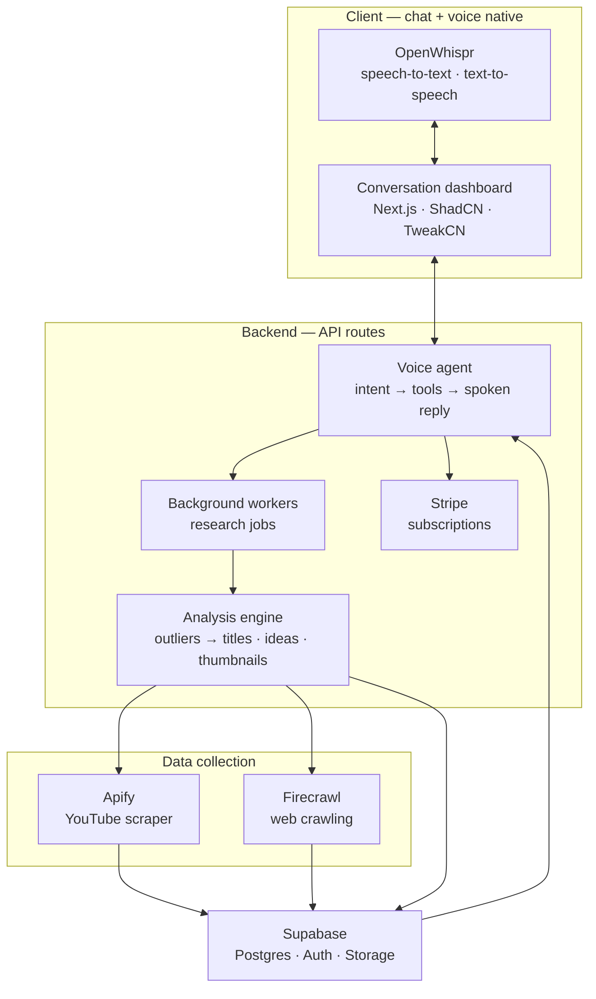
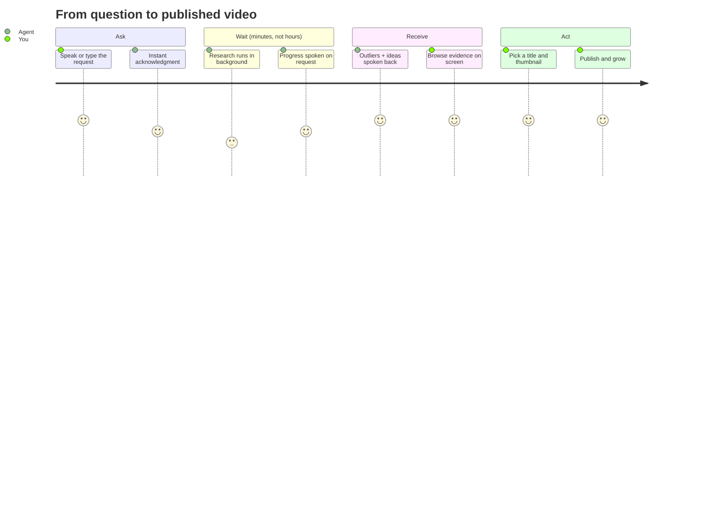
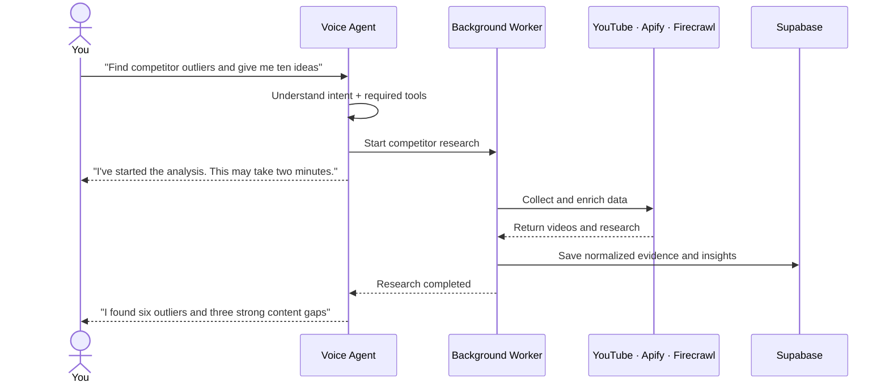
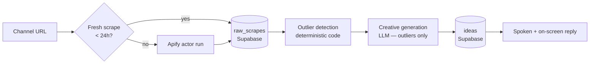
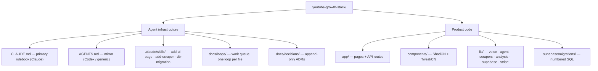
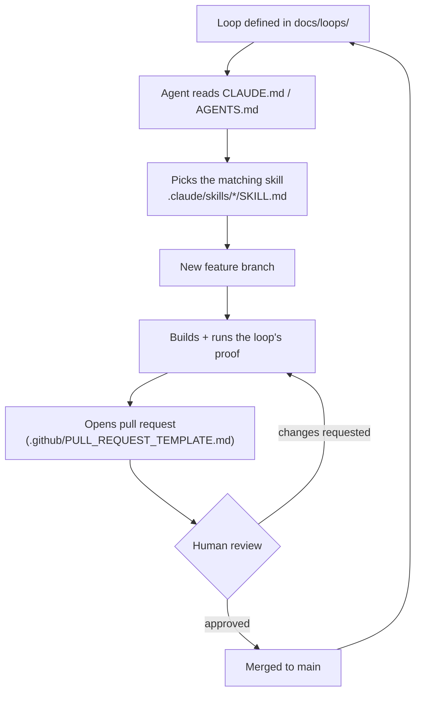
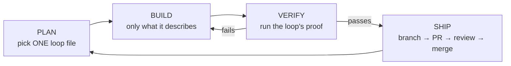

# YouTube Growth Stack

**Talk to your agent. It analyzes competitor channels, finds outlier videos, and
generates titles, video ideas, and thumbnail concepts — then talks back.**

Open source (MIT). Voice-native. Agent-first: the codebase is structured so
coding agents (Claude Code via `CLAUDE.md`, Codex via `AGENTS.md`) can pick up
work on their own and ship it through pull requests.

| | |
|---|---|
| Frontend | Next.js (App Router) · React · ShadCN + TweakCN theme |
| Voice | OpenWhispr (speech-to-text / text-to-speech) |
| Data | Apify (YouTube scraping) · Firecrawl (web enrichment) |
| Database | Supabase (Postgres · Auth · Storage) |
| Payments | Stripe subscriptions |
| Workflow | Loop engineering · skills · PR-gated agent work |

---

## 1 · Product architecture



## 2 · User experience

The dashboard is a conversation, not a form. One journey, four moments:



## 3 · Example conversation



## 4 · Data flow



Two cost rules are built into this flow: raw data is stored **before** analysis
(re-analyze for free, never re-scrape needlessly), and the LLM only ever sees
pre-filtered outliers (deterministic code does the cheap work first).

## 5 · Repository structure



## 6 · Agent workflow



The agent never pushes to `main`. Every merge passes a human.

## 7 · Implementation loop (how every unit of work ships)



Phases ship in order, each closing with running proof:

| Phase | Ships | Proof |
|---|---|---|
| 0 · Foundation | Repo, scaffold, rulebooks, skills | Build passes; agent opens a demo PR |
| 1 · Data | Supabase schema, Apify, Firecrawl | Real channel data lands in the database |
| 2 · Analysis | Outliers + idea engine | 10 stored suggestions with evidence |
| 3 · Interface | Chat + voice dashboard | Say it → agent speaks ideas back |
| 4 · Launch | Stripe, quotas, docs | Test payment clears; repo public |

---

## Getting started

```bash
npm install
cp .env.example .env.local   # fill in your own keys — never commit this file
npm run dev
```

The work queue lives in [`docs/loops/`](docs/loops/) — start with Loop 001.
Agents: read [`CLAUDE.md`](CLAUDE.md) (Claude) or [`AGENTS.md`](AGENTS.md)
(Codex/generic) before touching anything.

## License

[MIT](LICENSE) — build on it, sell it, fork it. Attribution appreciated.
